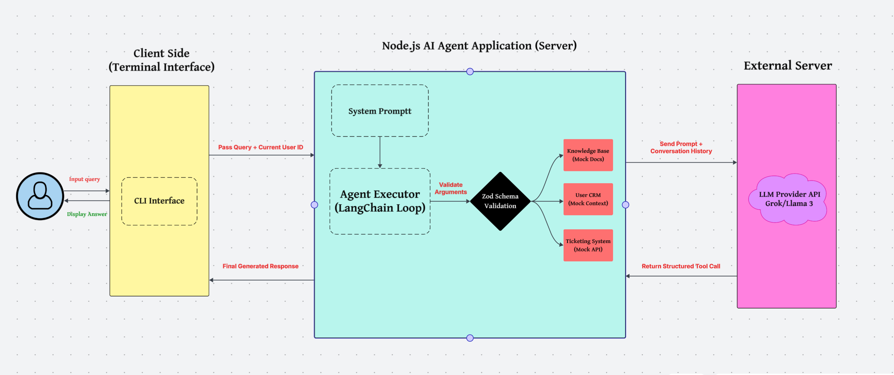
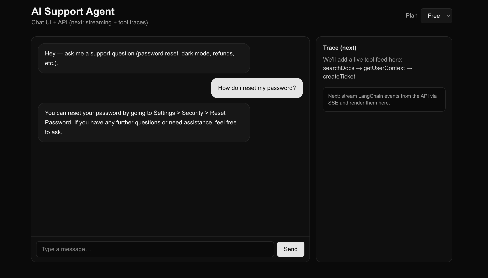

# Intro

Hi! This repo contains the code for a lightweight AI Agent that can handle basic customer service support, as well as raising a ticket if it thinks it need to escalate the matter further based on the urgency of the situation and whether or not the user is on a Free or Pro plan.

A 70B parameter Llama 3 LLM was chosen as a suitable node for this agent. It's hosted by Grok Console, which provides free API Access. You can use any other node of your choice as well to run the agent.

I built a Node.js & LangChain agent that acts as a first-line support rep. Instead of a linear script, the agent uses an LLM (Grok API here) as a reasoning engine (Router) to determine the next step based on a standard operating procedure.

## 🛠 How to Run This

Since you have the zip file, here is how to get it running on your machine:

1. **Unzip the folder** and open it in your terminal.
2. **Install dependencies:**
   ```bash
        npm install
    ```

3. **Set up the API Key:**
Create a file named `.env` in the root folder and add a Groq API key (it's free and fast). I used Groq instead of OpenAI & Claude for reducing costs (They do have have a free tier), but the logic is the same. Another approach is that we couldve used a lightweight LLM and run it locally but that would've compromised latency & accuracy.
    ```env
        GROQ_API_KEY=gsk_your_key_here
    ```


4. **Run the Agent:**
I included a small interactive menu so you can test as different users.
    ```bash
        npx tsx src/index.ts
    ```


---

## 🏗 How I Built It (Architecture)




**The Stack:**

* **Brain:** Llama 3.3 (via Groq).
* **Validation:** Zod.
* **Runtime:** Node.js + LangChain.

### Key Logic Flow

1. **Search Docs First:** The agent always tries to answer from the `mockDocs` first.
2. **Verify Context:** If it looks like a ticket is needed, it *must* check `getUserContext` first.
3. **Action:** It only opens a ticket if the docs failed and it knows the user's priority level.

---

## 💭 Decisions & Trade-offs

Here is why I made certain choices during the 6-hour window:

**1. Model Selection: Groq (Llama 3) vs. The Others I went with Llama 3.3 (via Groq) for this challenge.**

- Why not OpenAI or Claude? For many internal tools, keeping the API bill low could be a huge priority for clients.

- Why not Local/Self-Hosted? I also considered running a lightweight, quantized model (like a GGUF) locally or on a small AWS instance. The problem there is the trade-off between accuracy and latency.

Groq Console was the perfect middle ground. It gives me a powerful 70b parameter model that runs instantly (simulating a real production feel) and their free testing API allowed me to build this without incurring any costs was wonderful.

**2. Strict Zod Schemas**
I didn't want the agent to crash if the LLM made up a parameter. I wrapped every tool in a Zod schema. If the model tries to send a "criticality" field instead of "priority", the validation layer catches it before it breaks anything.

**3. In-Memory History**
To keep the task simple and runnable without Docker, I stored chat history in memory. In a real production app, I'd swap `AgentExecutor` for LangGraph and use Redis to save user sessions.

---

## 📸 Screenshots




---

## 🧪 Things to Try

When you run the app, try these scenarios to see the logic kick in:

* **Test the "Deflection":**
Ask: *"How do I switch to dark mode?"*
(It should answer you directly and not open a ticket.)
* **Test the "Pro" Logic:**
Login as Option 1 (Pro) and say: *"I have a billing issue and it's urgent."*
(It should see you are Pro and force a High priority ticket.)
* **Test the "Policy" Logic:**
Login as Option 2 (Regular) and say the exact same thing: *"I have a billing issue and it's urgent."*
(It should see you are on the Free plan and create a Medium ticket, ignoring your request for urgent priority.)

Enjoy the code!

*Made with ❤️ by Yoonus*
